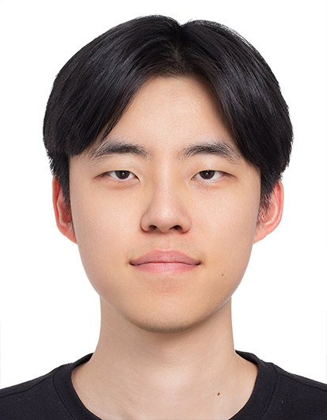

## About Me

I am currently a Ph.D. candidate in chemistry at KAIST.
I am interested in deep learning methods for chemistry and drug discovery - quantum chemistry, molecular optimization, predicting biomolecule structures, and synthesis planning. 
[Google Scholar](https://scholar.google.com/citations?view_op=list_works&hl=ko&hl=ko&user=YpiY1q8AAAAJ) | [GitHub](https://github.com/Hwoo-Kim) | [LinkedIn](https://www.linkedin.com/in/hyeongwoo-kim-784bb2291/)

## Research Interest

My research focuses on how to integrate physics and chemistry into deep learning methods to solve large-scale systems such as proteins.
I am very interested in Physics-Informed Neural Networks (PINN), geometric deep learning, and generative models.

## Educations
<!-- KAIST - Ph.D. -->
**Korea Advanced Institute of Science and Technology (KAIST)** 
September 2020 - present 
Ph.D. candidate in Chemistry 

<!-- KAIST - chemistry-->
**Korea Advanced Institute of Science and Technology (KAIST)** 
March 2016 - August 2020 
Major in Chemistry, Minor in Physics 
KAIST presidential fellowship (KPF)

<!-- Kangwon science highschool -->
**Kangwon Science High School** 
March 2014 - February 2016

## Publications and preprints
<!-- DDSBM -->
**Discrete Diffusion Schrödinger Bridge Matching for Graph Transformation** 
Jun Hyeong Kim\*, Seonghwan Kim\*, Seokhyun Moon\*, <u>Hyeongwoo Kim</u>\*, Jeheon Woo\*, Woo Youn Kim 
ICLR 2025 
[Paper](https://openreview.net/forum?id=tQyh0gnfqW)

<!-- DeepBioisostere -->
**DeepBioisostere: Discovering Bioisosteres with Deep Learning for a Fine Control of Multiple Molecular Properties** 
<u>Hyeongwoo Kim</u>\*, Seokhyun Moon\*, Wonho Zhung, Jaechang Lim, Woo Youn Kim 
Arxiv preprints, 2024 
[Paper](https://arxiv.org/abs/2403.02706) | [Code](https://github.com/Hwoo-Kim/DeepBioisostere)

<!-- DeepICL -->
**3D molecular generative framework for interaction-guided drug design** 
Wonho Zhung\*, <u>Hyeongwoo Kim</u>, Woo Youn Kim 
Nature Communications, 2024 
[Paper](https://www.nature.com/articles/s41467-024-47011-2) | [Code](https://github.com/ACE-KAIST/DeepICL)

<!-- DFRscore -->
**DFRscore: Deep learning-based scoring of synthetic complexity with drug-focused retrosynthetic analysis for high-throughput virtual screening** 
<u>Hyeongwoo Kim</u>\*, Kynghoon Lee\*, Chansu Kim, Jaechang Lim, Woo Youn Kim 
Journal of Chemical Information and Modeling, 2023 
[Paper](https://pubs.acs.org/doi/abs/10.1021/acs.jcim.3c01134) | [Code](https://github.com/Hwoo-Kim/DFRscore)

## Draft papers
<!-- Differentiable structure of Kabsch -->
**Differentiable Structure of the Kabsch Algorithm** (2025) 
<u>Hyeongwoo Kim</u>\* 
[Paper](files/Differentiable_Structure_of_the_Kabsch_Algorithm.pdf)

## Presentations
<!-- 2024 spring KIChe -->
**2024 Spring Korean Institute of Chemical Engineers Meeting - Oral** 
DeepBioisostere: Discovering Bioisosteres with Deep Learning for a Delicate Control of Multiple Molecular Properties 
<u>Hyeongwoo Kim</u>\*, Seokhyun Moon\*, Wonho Zhung, Jaechang Lim, Woo Youn Kim 
[PPT](files/2024_spring_KIChe_DeepBioisostere.pdf)

<!-- 2022 spring KCS -->
**2022 Spring Korean Chemistry Society Conference - Poster** 
ENSS: Estimating the Number of Synthetic Steps by Graph-based Deep Learning for Virtual Screening (2022) 
<u>Hyeongwoo Kim</u>\*, Kynghoon Lee\*, Woo Youn Kim 
[Poster](files/2022_spring_KCS_ENSS.pdf)

## Awards
<!-- 2022 spring KCS -->
**The Excellent Poster Award in the 2022 Spring Korean Chemistry Society Conference** 
ENSS: Estimating the Number of Synthetic Steps by Graph-based Deep Learning for Virtual Screening (2022) 
[Poster](files/2022_spring_KCS_ENSS.pdf)

<!--
Year | Award | Category
-----|-------|--------
2014 | Emmy  | Won Outstanding Lead Actor in a miniseries or a movie
-->